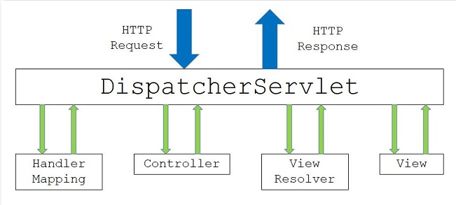
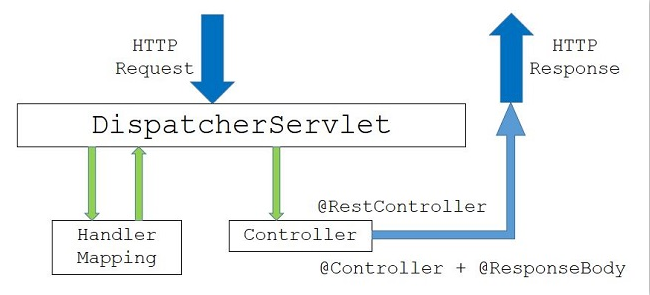

## Spring MVC

### Spring MVC 구조 처리 과정을 설명할 수 있는가 ? (MVC Process)

Spring MVC 일반적인 구조이다.

Spring MVC 구조

---
Spring MVC 처리 순서는 아래와 같다.

1. Client가 Server에 Request를 보낸다면, **Spring에서 제공하는 DispatcherServlet이라는 클래스(front controller)가 요청을 가로챈다.**
2. 요청을 가로챈 DispatcherServlet은 HandlerMapping(URL...)에게 어떤 컨트롤러에게 요청을 위임하면 좋을지 물어본다. 
   (HandlerMapping은 **@Controller로 등록한 것들을 Scan** 해놨기 때문에 어느 Controller에게 요청을 위임할지 알고 있다.)
3. 요청에 매핑된 컨트롤러가 있다면 @RequestMapping을 통하여 요청을 처리할 메서드에 도달한다.
4. 컨트롤러에서는 해당 요청을 처리할 Service를 주입(DI)받아 비즈니스로직을 Service에게 위임한다.
5. Service에서는 요청에 필요한 작업 대부분(코딩했던 것)을 담당하며, DB에 접근이 필요하면 DAO(Repository)를 주입받아 DB처리는 DAO에게 위임한다.
6. DAO는 MyBatis(or Hibernate 등) 설정을 이용해서 SQL 쿼리를 날려 DB에 저장되어 있는 정보를 받아 Service에게 다시 돌려준다.  
   (이때, 보통 Request와 함게 날아온 DTO 객체(@RequestParam, @RequestBody...)로부터 DB 조회에 필요한 데이터를 받아와
  쿼리를 만들어내고, 결과로 받은 Entity 객체를 가지고 Response(Response Class)에 필요한 DTO 객체로 변환한다.)
7. 모든 비즈니스 로직을 끝낸 Service가 결과물을 Controller에게 넘긴다.
8. 결과물을 받은 컨트롤러는 필요에 따라 Model 객체에 결과물을 넣거나, 어떤 view(.jsp)파일을 보여줄 것인지 등의 정보를 담아
DispatcherServlet에게 넘긴다.
9. DispatcherServlet은 ViewResolver에게 받은 뷰에 대한 정보를 넘긴다.
10. ViewResolver는 해당 JSP를 찾아서(응답할 View) DispatcherServlet에게 알려준다.
11. DispatcherServlet은 응답할 View에게 Render를 지시하고, View는 응답 로직을 처리한다.
12. 결과적으로 DispatcherServlet이 Client에게 렌더링된 View를 응답하게 된다.